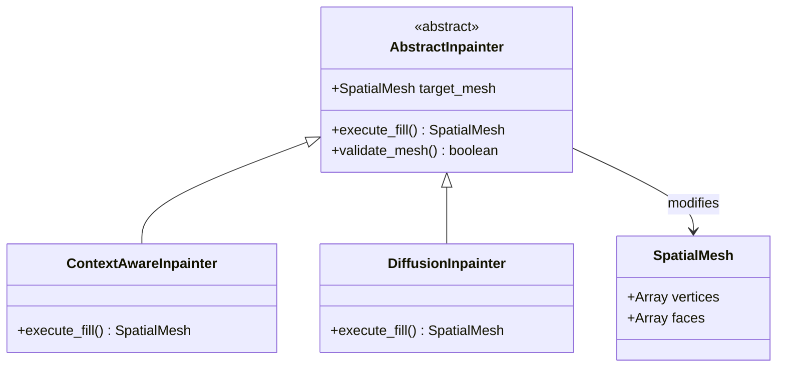
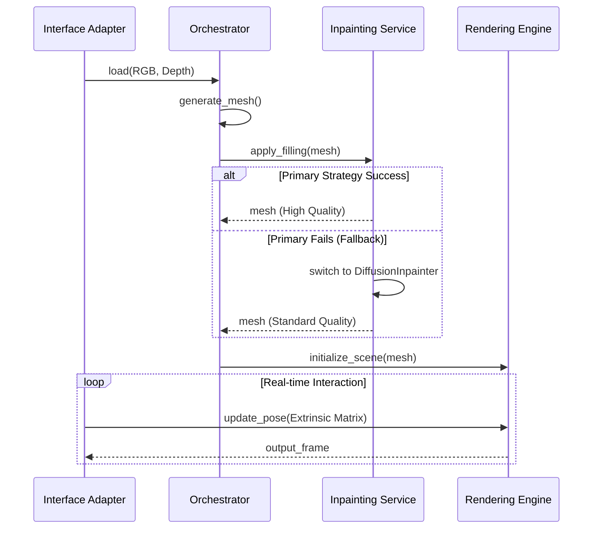

# PIM 框架：3D 照片合成引擎 (3D Photo Synthesis Engine)

## 1. 專案概述 (Project Overview)

### 1.1 願景 (Vision)
建構一個可跨平台部署的 3D 照片合成核心引擎，能接收單張具透視變形的 2D 圖片與對應的深度圖（RGB-D），並基於幾何反投影與彈性的遮擋修補策略，生成可即時互動與自由變換視角的 3D 空間網格（Spatial Mesh）。

### 1.2 目標 (Objectives)
- 目標 1：實現準確的 2D 到 3D 空間反投影（Unprojection）幾何轉換。
- 目標 2：建立抽象的動態邊緣偵測（Edge Detection）機制，防止深度斷層導致的視覺拉伸。
- 目標 3：設計具備容錯與降級機制（Fallback）的遮擋修補（Inpainting）模組。
- 目標 4：提供標準化的輸入埠，接收外部感測或 UI 操作事件以即時更新虛擬相機視角。

### 1.3 預期用途 (Intended Use)
- **主要情境**：系統接收靜態 RGB-D 影像後，生成核心 3D 網格資料結構。渲染模組被動接收來自外部（如滑鼠拖曳、裝置陀螺儀）的相機位姿變化，即時輸出對應的 2D 視角畫面。
- **使用限制**：假設輸入之 RGB 影像與深度圖在空間解析度上已初步對齊。系統本身不負責定義自動運鏡的軌跡，純粹作為受控的渲染核心。

### 1.4 範圍邊界 (Scope Boundaries)
**包含範圍 (In Scope)**：
- RGB-D 資料攝取與正規化處理邏輯。
- 點雲與網格生成邏輯（包含斷邊判定）。
- 多軌並存的遮擋修補抽象邏輯（2D 像素擴散與 3D 空間分層）。
- 接收外部事件轉換為相機外參矩陣的介面適配邏輯。
- 虛擬相機投影與即時畫面渲染邏輯。

**排除範圍 (Out of Scope)**：
- 單張圖片的深度預測 AI 模型生成。
- 外部控制端（如前端 UI 介面或硬體陀螺儀）的實作細節。
- 特定圖形 API（如 WebGL, OpenGL）的硬體加速實作。

### 1.5 利害關係人 (Stakeholders)
| 類型 | 名稱/角色 | 關注點 |
|------|-----------|--------|
| 使用者 | 終端瀏覽者 | 視角變換的流暢度與視覺品質（無破圖或拉伸） |
| 開發者 | 系統整合工程師 | 模組介面的低耦合性、演算法抽換的便利性 |

---

## 2. 系統需求 (System Requirements)

### 2.1 功能性需求 (Functional Requirements)
| ID | 需求名稱 | 需求描述 | 輸入 | 輸出 | 優先級 | 驗證方式 |
|----|----------|----------|------|------|--------|----------|
| FR-001 | 資料攝取與對齊 | 驗證並調整 RGB 與深度圖維度一致，並常規化深度值。 | RGB圖, 深度圖 | 對齊的 RGB-D 矩陣 | 高 | 單元測試 |
| FR-002 | 空間反投影 | 將像素 $(u,v)$ 與深度 $Z$ 依據相機內參推算為 3D 座標 $(X,Y,Z)$。 | RGB-D, 內參矩陣 | 3D 點雲 | 高 | 幾何數學驗證 |
| FR-003 | 動態邊緣斷離 | 依據抽象策略評估相鄰像素深度差，超過閾值則切斷網格連線。 | 3D 點雲 | 帶有破洞的網格 | 高 | 拓樸結構檢查 |
| FR-004 | 彈性遮擋修補 | 針對破洞執行修補，並支援策略降級（如從 3D LDI 降級為 2D 擴散）。 | 破洞網格 | 完整 3D 網格 | 高 | 整合測試 |
| FR-005 | 外部位姿接收 | 監聽並轉換外部操作訊號為標準相機外參矩陣（旋轉與平移）。 | 外部操作訊號 | 外參矩陣 | 高 | 介面模擬測試 |
| FR-006 | 即時視角渲染 | 依據最新的相機外參矩陣，將 3D 網格重新投影為 2D 畫面。 | 完整網格, 外參 | 2D 渲染幀 | 高 | 視覺輸出比對 |

### 2.2 非功能性需求 (Non-Functional Requirements)
| ID | 類別 | 描述 | 衡量指標 | 備註 |
|----|------|------|----------|------|
| NFR-001 | 擴展性 (Extensibility) | 修補邏輯必須使用繼承自主系統類別的邏輯來確保一致性，避免孤立的運算腳本。 | 通過架構審查 | 支援動態抽換 |
| NFR-002 | 響應性 (Responsiveness) | 外部相機位姿更新到畫面渲染的延遲必須極小化，支援即時互動。 | 延遲時間判定 | 依賴後續 PSM |
| NFR-003 | 容錯性 (Fault Tolerance)| 若高階修補策略運算失敗或超時，需自動 Fallback 至基礎策略。 | 降級成功率 | 保障畫面輸出 |

### 2.3 約束條件 (Constraints)
- 系統內部幾何運算需保持浮點數精度。
- 模組間溝通必須透過抽象資料結構（如 `SpatialMesh`），嚴禁模組直接操作底層硬體暫存區。

### 2.4 假設條件 (Assumptions)
- 假設輸入的深度圖數值已經具備足夠的相對深度梯度資訊。
- 假設外部系統能夠穩定提供正確格式的操作事件訊號。

---

## 3. 系統架構設計 (System Architecture)

### 3.1 架構目標 (Architectural Goals)
- 將「核心幾何與修補邏輯」與「外部控制與圖形渲染」嚴格解耦。
- 提供統一的基礎類別（Base Classes），確保所有擴充模組繼承主系統邏輯，維持狀態管理與資料結構的一致性。

### 3.2 高階模組分解 (High-Level Module Decomposition)
| 模組名稱 | 職責 | 對外介面 | 相依模組 |
|----------|------|----------|----------|
| Ingestion & Adapter | 資料載入、外部控制訊號轉化為系統指令 | `load_assets()`, `on_pose_event()` | Orchestrator |
| Geometry Engine | 反投影計算、網格生成與邊緣斷開策略 | `unproject()`, `build_mesh()` | Ingestion |
| Inpainting Service | 統籌多種修補策略與 Fallback 機制 | `apply_filling()` | Geometry Engine |
| Rendering Engine | 管理虛擬相機狀態並輸出最終畫面 | `render_frame()` | Inpainting, Adapter|

### 3.3 邏輯視圖 (Logical View)
- `Inpainting Service` 實作策略模式。底層存在一個 `AbstractInpainter` 主類別，統一定義資料存取與驗證邏輯。
- 高階的 `ContextAwareInpainter` (3D/AI) 與基礎的 `DiffusionInpainter` (2D) 皆繼承自該主類別。這確保了無論走哪一條修補路徑，對於主系統而言都是一致的操作介面與生命週期。

### 3.4 架構圖 (Architecture Diagram)
```mermaid
flowchart TD
    UI[External Events: Mouse/Gyro] --> IA[Interface Adapter Layer]
    Data[External RGB-D] --> IA
    
    IA --> ORC[Orchestration Layer]
    
    ORC --> GEO[Geometry Engine]
    
    subgraph Inpainting Service
        ABS[AbstractInpainter]
        AI[ContextAwareInpainter - Primary]
        DIFF[DiffusionInpainter - Fallback]
        ABS <|-- AI
        ABS <|-- DIFF
    end
    
    GEO --> Inpainting Service
    
    Inpainting Service --> REN[Rendering Engine]
    IA -->|Extrinsic Matrix Update| REN
    
    REN --> OUT[Rendered 2D View]
```

---

## 4. 核心資料結構 (Core Data Schema)

### 4.1 核心實體 (Core Entities)
| 實體名稱 | 說明 | 主要屬性 | 備註 |
|----------|------|----------|------|
| `RGBDFrame` | 正規化後的色彩與深度矩陣 | `width, height, rgb_data, depth_data` | |
| `SpatialMesh` | 系統內流通的統一 3D 結構 | `vertices, faces, uvs, texture_map` | 所有修補策略共用 |
| `CameraPose` | 虛擬相機狀態矩陣 | `intrinsic_mat, extrinsic_mat` | |
| `EdgePolicy` | 邊緣判定設定檔 | `dynamic_threshold, min_depth_delta` | |

### 4.2 結構模型 (Structural Model)


---

## 5. 輸入/輸出轉換邏輯 (I/O Adapters)

### 5.1 輸入來源抽象 (Abstract Input Sources)
- **靜態資產埠**：接收並解析圖片二進制流 (RGB 檔案, Depth 檔案)。
- **事件監聽埠**：接收相對座標位移 (如 $\Delta X, \Delta Y$) 或四元數旋轉資料 (Quaternion)。

### 5.2 輸出目標抽象 (Abstract Output Targets)
- **畫面更新埠**：向外部環境拋出已渲染完畢的二維像素陣列 (Pixel Array / Framebuffer)。
- **網格匯出埠 (Optional)**：提供序列化 `SpatialMesh` 的介面以供外部 3D 軟體調用。

### 5.3 轉換規則 (Transformation Rules)
| 規則ID | 來源事件 | 轉換描述 | 目標狀態 |
|--------|----------|----------|----------|
| IO-001 | 滑鼠拖曳 $(\Delta X, \Delta Y)$ | 映射為相機平移向量 $t$ 或繞特定軸的旋轉矩陣 $R$。 | 更新 `CameraPose.extrinsic_mat` |
| IO-002 | 陀螺儀 Quaternion | 直接轉換為相機外參的旋轉矩陣 $R$。 | 更新 `CameraPose.extrinsic_mat` |

---

## 6. 動態行為模型 (Dynamic Behavior Models)

### 6.1 主要流程 (Primary Flow)
1. 系統載入 RGB-D 並完成正規化。
2. 幾何引擎依據內參進行反投影，並套用 `EdgePolicy` 斷開深度差異過大的頂點連接。
3. 協調層呼叫 `Inpainting Service`，預設執行 `ContextAwareInpainter`。
4. 修補完成後，生成最終 `SpatialMesh` 並交付渲染引擎。
5. 渲染引擎進入事件迴圈 (Event Loop)，等待外部 `CameraPose` 更新並即時重繪畫面。

### 6.2 替代流程 (Alternative Flow: Inpainting Fallback)
1. 在執行 `ContextAwareInpainter` 時發生超時或硬體異常。
2. 系統捕捉錯誤，記錄日誌。
3. 協調層觸發降級機制，實例化並呼叫繼承自同一個主類別的 `DiffusionInpainter`。
4. 以較低品質但穩定的方式補齊 `SpatialMesh`，確保後續渲染不中斷。

### 6.3 序列圖 (Sequence Diagram)


---

## 7. 業務規則與決策 (Business Rules and Decisions)

### 7.1 業務規則 (Business Rules)
- **BR-001 (狀態一致性)**：所有修補演算法都必須透過繼承 `AbstractInpainter` 實作，確保資料流與檢驗邏輯的一致，避免獨立運算邏輯造成的系統碎裂。
- **BR-002 (動態邊緣斷層判定)**：在建立多邊形網格時，必須調用 `EdgePolicy` 介面。系統容許 PSM 階段以靜態常數或全域動態演算法實作該介面，但 PIM 層級強制要求執行該檢查。

### 7.2 決策表：修補策略選擇 (Decision Table)
| 條件：硬體支援進階 API | 條件：計算資源充足 | 條件：外部指定要求 | 執行動作 |
|------------------------|--------------------|--------------------|----------|
| 是                     | 是                 | 自動 / 高品質      | 啟動 `ContextAwareInpainter` |
| 是                     | 否                 | 自動               | 啟動 `DiffusionInpainter` |
| 否                     | -                  | -                  | 強制啟動 `DiffusionInpainter` |

---

## 8. 設計決策日誌 (Design Decision Log)

| 決策ID | 決策內容 | 理由 | 影響 |
|--------|----------|------|------|
| DD-001 | 確立修補模組的繼承體系 | 確保各種修補策略能共用網格驗證與狀態管理的邏輯，提升系統擴充時的一致性與維護性。 | 規範了擴充模組的開發標準。 |
| DD-002 | 視角控制由外部推播 | 核心引擎不需處理複雜的互動事件綁定（如 DOM 事件或底層驅動），維持平台無關性。 | 介面適配層必須承擔訊號轉換的責任。 |

---

## 9. 驗證與追溯 (Validation and Traceability)
*(略：同前述一致性檢查原則，確保需求 FR-001 ~ FR-006 皆映射至對應模組)*

## 10. PIM 到 PSM 映射準備 (Preparation for PIM-to-PSM Transformation)
此框架已準備好朝向特定技術棧推進：
- `AbstractInpainter` 可映射為 Python 的 `abc.ABC` 抽象基底類別或 TypeScript 的 `interface/abstract class`。
- `Rendering Engine` 可映射為 Python 環境下的 OpenGL 綁定、或是 Web 前端的 WebGL/Three.js 實作。
- I/O 轉換邏輯準備好與 Python 的 GUI 框架事件驅動或瀏覽器的 DOM 事件系統對接。

---