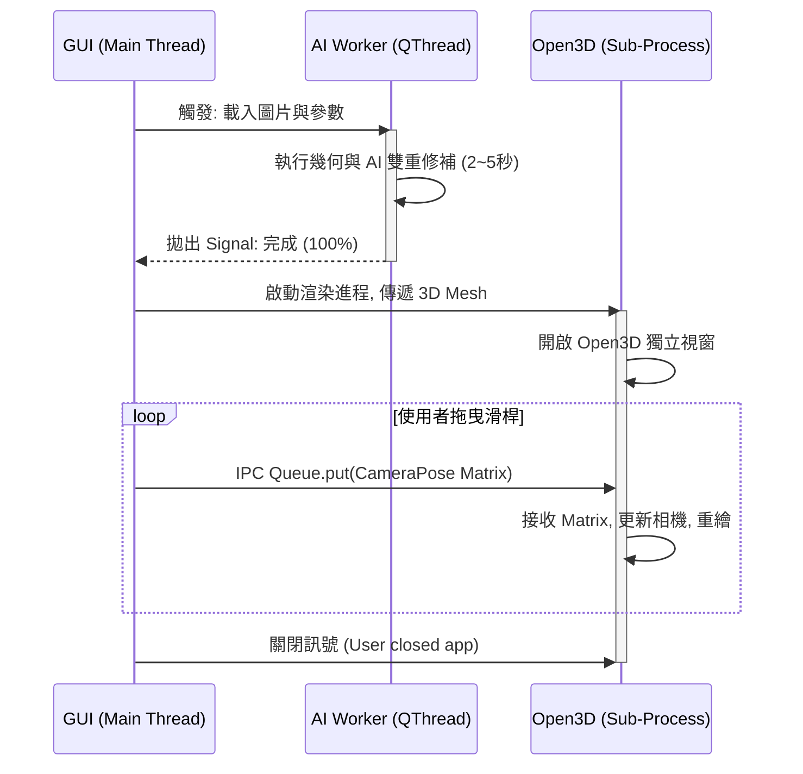

# PSM 設計文件：執行緒與並行模型 (Concurrency & Threading Model)
**文件路徑**：`docs/PSM/06_Concurrency_and_Threading.md`
**文件版本**：v1.0 (2026-05-27)
**針對環境**：Python 3.10+, PySide6, multiprocessing

## 1. 執行緒/進程邊界劃分 (Concurrency Boundaries)

為了保證 GUI 的極致流暢與 Open3D 渲染器的獨立性，系統將劃分為 1 個主進程與 1 個子進程，主進程內再細分執行緒：

### 🎯 邊界 A：主進程 (Main OS Process)
* **Thread 0: GUI 主執行緒 (PySide6 Main Thread)**
    * **職責**：運行 UI 事件迴圈 (`app.exec()`)、渲染選單與滑桿、攔截使用者點擊。
    * **禁忌**：絕對不允許執行任何超過 16 毫秒 (16ms) 的運算（禁用迴圈、禁止呼叫 AI 模型）。
* **Thread 1: AI 運算背景執行緒 (Worker QThread)**
    * **職責**：執行 `Orchestrator` 的資料流。載入 Numpy、幾何反投影、執行 PyTorch LaMa 推論。
    * **通訊**：算完後，透過 `QSignal` 通知 GUI「進度 100%」，並將最終的 3D 網格 (Mesh) 序列化。

### 🎯 邊界 B：獨立渲染子進程 (Render OS Process)
* **Process 2: Open3D 渲染進程 (multiprocessing.Process)**
    * **職責**：獨佔一個全新的作業系統進程。擁有自己的 Main Thread 來運行 Open3D 的 `vis.run()`，避免與 Qt 搶奪底層視窗控制權。
    * **通訊**：透過跨進程通訊 (`multiprocessing.Queue`) 接收來自 Thread 0 的相機位姿矩陣，並即時重繪畫面。

## 2. 生命週期與資料傳遞時序 (Lifecycle & Data Flow)

以下規範實作工程師在串接系統時，必須遵守的非同步呼叫順序：

## 3. 記憶體管理與跨進程通訊 (IPC) 規範
* **避免序列化瓶頸**：3D Mesh 資料龐大，若透過標準 Queue 傳遞給 Render 進程會導致嚴重卡頓。
* **PSM 實作約束**：
    1. AI Worker 算完 Mesh 後，將頂點與顏色存入臨時記憶體映射檔 (`tempfile` 或 `multiprocessing.shared_memory`)。
    2. 只透過 IPC Queue 傳遞「檔案路徑」或「記憶體指標」。
    3. Render 進程收到指標後，自行讀取並實例化 `o3d.geometry.TriangleMesh`。