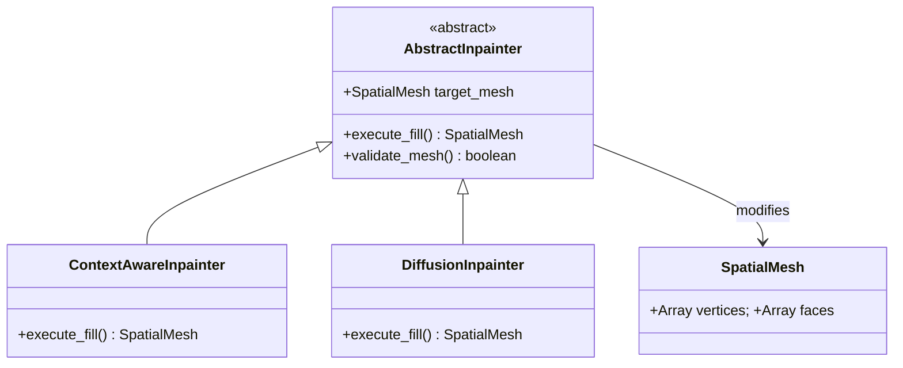
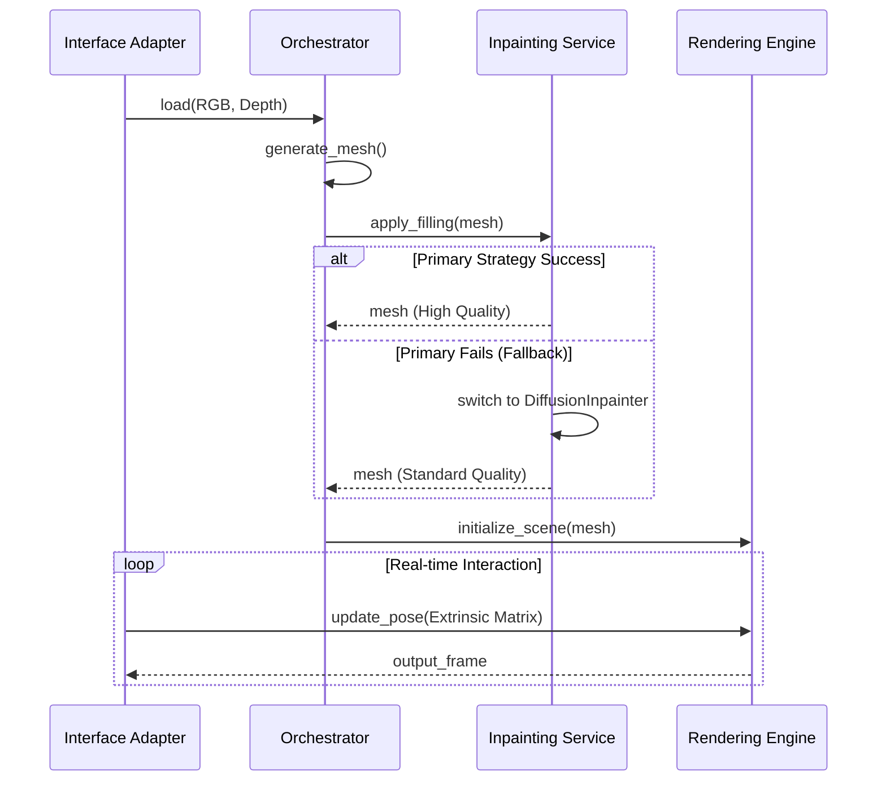
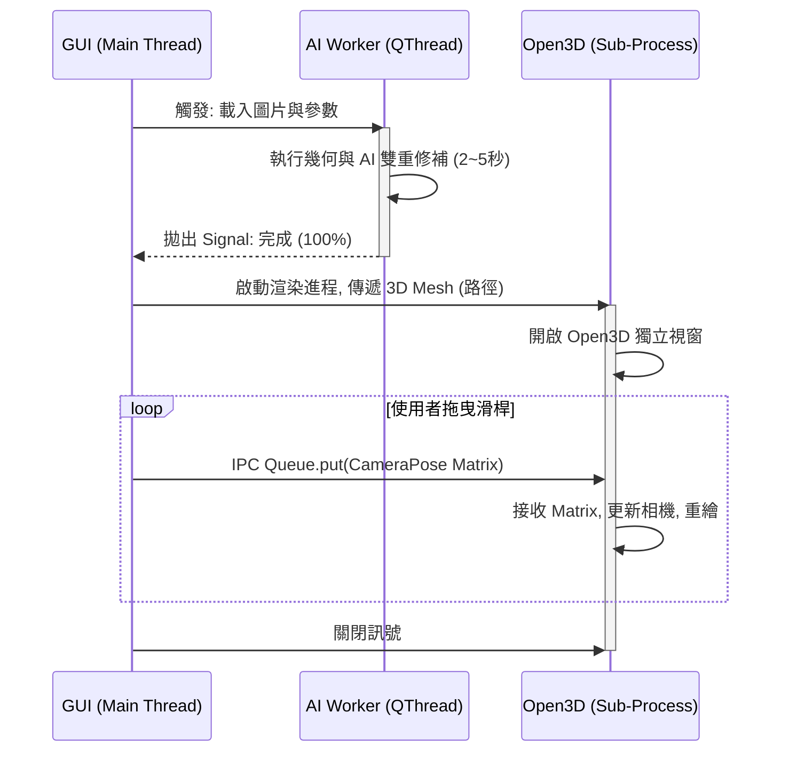

# 3D Photo Synthesis Engine 核心設計主體

文件角色：正式設計主文件（Core Design Authority）

內容範圍：
- 第一部分：平台無關模型（PIM）
- 第二部分：平台特定模型（PSM）
- 第三部分：設計決策日誌（ADR）

AI 閱讀指引：
- 若問題是「系統應如何設計」，以本文件為優先依據。
- 若問題涉及測試、驗證、基準，請轉讀 `02_verification_testing.md`。
- 若問題涉及團隊規範、紅線、協作原則，請轉讀 `03_system_engineering_handover.md`。

---

# 第一部分：平台無關模型 (PIM)

*Platform-Independent Model — 3D Photo Synthesis Engine*

## 1. 專案概述 (Project Overview)

### 1.1 願景 (Vision)

建構一個可跨平台部署的 3D 照片合成核心引擎，能接收單張具透視變形的 2D 圖片與對應的深度圖（RGB-D），並基於幾何反投影與彈性的遮擋修補策略，生成可即時互動與自由變換視角的 3D 空間網格（Spatial Mesh）。

### 1.2 目標 (Objectives)

* 目標 1：實現準確的 2D 到 3D 空間反投影（Unprojection）幾何轉換。
* 目標 2：建立抽象的動態邊緣偵測（Edge Detection）機制，防止深度斷層導致的視覺拉伸。
* 目標 3：設計具備容錯與降級機制（Fallback）的遮擋修補（Inpainting）模組。
* 目標 4：提供標準化的輸入埠，接收外部感測或 UI 操作事件以即時更新虛擬相機視角。

### 1.3 預期用途 (Intended Use)

**主要情境：**

系統接收靜態 RGB-D 影像後，生成核心 3D 網格資料結構。渲染模組被動接收來自外部（如滑鼠拖曳、裝置陀螺儀）的相機位姿變化，即時輸出對應的 2D 視角畫面。

**使用限制：**

假設輸入之 RGB 影像與深度圖在空間解析度上已初步對齊。系統本身不負責定義自動運鏡的軌跡，純粹作為受控的渲染核心。

### 1.4 範圍邊界 (Scope Boundaries)

**包含範圍 (In Scope)：**

* RGB-D 資料攝取與正規化處理邏輯。
* 點雲與網格生成邏輯（包含斷邊判定）。
* 多軌並存的遮擋修補抽象邏輯（2D 像素擴散與 3D 空間分層）。
* 接收外部事件轉換為相機外參矩陣的介面適配邏輯。
* 虛擬相機投影與即時畫面渲染邏輯。

**排除範圍 (Out of Scope)：**

* 單張圖片的深度預測 AI 模型生成。
* 外部控制端（如前端 UI 介面或硬體陀螺儀）的實作細節。
* 特定圖形 API（如 WebGL, OpenGL）的硬體加速實作。

### 1.5 利害關係人 (Stakeholders)

| 類型 | 名稱/角色 | 關注點 |
| --- | --- | --- |
| 使用者 | 終端瀏覽者 | 視角變換的流暢度與視覺品質（無破圖或拉伸） |
| 開發者 | 系統整合工程師 | 模組介面的低耦合性、演算法抽換的便利性 |

## 2. 系統需求 (System Requirements)

### 2.1 功能性需求 (Functional Requirements)

| ID | 需求名稱 | 需求描述 | 輸入 | 輸出 | 優先級 | 驗證方式 |
| --- | --- | --- | --- | --- | --- | --- |
| FR-001 | 資料攝取與對齊 | 驗證並調整 RGB 與深度圖維度一致，並常規化深度值。 | RGB圖, 深度圖 | 對齊的 RGB-D 矩陣 | 高 | 單元測試 |
| FR-002 | 空間反投影 | 將像素 (u,v) 與深度 Z 依據相機內參推算為 3D 座標 (X,Y,Z)。 | RGB-D, 內參矩陣 | 3D 點雲 | 高 | 幾何數學驗證 |
| FR-003 | 動態邊緣斷離 | 依據抽象策略評估相鄰像素深度差，超過閾值則切斷網格連線。 | 3D 點雲 | 帶有破洞的網格 | 高 | 拓樸結構檢查 |
| FR-004 | 彈性遮擋修補 | 針對破洞執行修補，並支援策略降級（如從 3D LDI 降級為 2D 擴散）。 | 破洞網格 | 完整 3D 網格 | 高 | 整合測試 |
| FR-005 | 外部位姿接收 | 監聽並轉換外部操作訊號為標準相機外參矩陣（旋轉與平移）。 | 外部操作訊號 | 外參矩陣 | 高 | 介面模擬測試 |
| FR-006 | 即時視角渲染 | 依據最新的相機外參矩陣，將 3D 網格重新投影為 2D 畫面。 | 完整網格, 外參 | 2D 渲染幀 | 高 | 視覺輸出比對 |

### 2.2 非功能性需求 (Non-Functional Requirements)

| ID | 類別 | 描述 | 衡量指標 | 備註 |
| --- | --- | --- | --- | --- |
| NFR-001 | 擴展性 | 修補邏輯必須使用繼承自主系統類別的邏輯來確保一致性，避免孤立的運算腳本。 | 通過架構審查 | 支援動態抽換 |
| NFR-002 | 響應性 | 外部相機位姿更新到畫面渲染的延遲必須極小化，支援即時互動。 | 延遲時間判定 | 依賴後續 PSM |
| NFR-003 | 容錯性 | 若高階修補策略運算失敗或超時，需自動 Fallback 至基礎策略。 | 降級成功率 | 保障畫面輸出 |

### 2.3 約束條件 (Constraints)

* 系統內部幾何運算需保持浮點數精度。
* 模組間溝通必須透過抽象資料結構（如 SpatialMesh），嚴禁模組直接操作底層硬體暫存區。

### 2.4 假設條件 (Assumptions)

* 假設輸入的深度圖數值已經具備足夠的相對深度梯度資訊。
* 假設外部系統能夠穩定提供正確格式的操作事件訊號。

## 3. 系統架構設計 (System Architecture)

### 3.1 架構目標 (Architectural Goals)

* 將「核心幾何與修補邏輯」與「外部控制與圖形渲染」嚴格解耦。
* 提供統一的基礎類別（Base Classes），確保所有擴充模組繼承主系統邏輯，維持狀態管理與資料結構的一致性。

### 3.2 高階模組分解 (High-Level Module Decomposition)

| 模組名稱 | 職責 | 對外介面 | 相依模組 |
| --- | --- | --- | --- |
| Ingestion & Adapter | 資料載入、外部控制訊號轉化為系統指令 | load_assets(), on_pose_event() | Orchestrator |
| Geometry Engine | 反投影計算、網格生成與邊緣斷開策略 | unproject(), build_mesh() | Ingestion |
| Inpainting Service | 統籌多種修補策略與 Fallback 機制 | apply_filling() | Geometry Engine |
| Rendering Engine | 管理虛擬相機狀態並輸出最終畫面 | render_frame() | Inpainting, Adapter |

### 3.3 邏輯視圖 (Logical View)

Inpainting Service 實作策略模式。底層存在一個 AbstractInpainter 主類別，統一定義資料存取與驗證邏輯。

高階的 ContextAwareInpainter (3D/AI) 與基礎的 DiffusionInpainter (2D) 皆繼承自該主類別。這確保了無論走哪一條修補路徑，對於主系統而言都是一致的操作介面與生命週期。

### 3.4 架構圖 (Architecture Diagram)

```mermaid
flowchart TD
UI[External Events: Mouse/Gyro] --> IA[Interface Adapter Layer]
Data[External RGB-D] --> IA
IA --> ORC[Orchestration Layer]
ORC --> GEO[Geometry Engine]
subgraph Inpainting Service
ABS[AbstractInpainter]
AI[ContextAwareInpainter - Primary]
DIFF[DiffusionInpainter - Fallback]
ABS <|-- AI
ABS <|-- DIFF
end
GEO --> Inpainting Service
Inpainting Service --> REN[Rendering Engine]
IA -->|Extrinsic Matrix Update| REN
REN --> OUT[Rendered 2D View]
```

## 4. 核心資料結構 (Core Data Schema)

### 4.1 核心實體 (Core Entities)

| 實體名稱 | 說明 | 主要屬性 | 備註 |
| --- | --- | --- | --- |
| RGBDFrame | 正規化後的色彩與深度矩陣 | width, height, rgb_data, depth_data |  |
| SpatialMesh | 系統內流通的統一 3D 結構 | vertices, faces, uvs, texture_map | 所有修補策略共用 |
| CameraPose | 虛擬相機狀態矩陣 | intrinsic_mat, extrinsic_mat |  |
| EdgePolicy | 邊緣判定設定檔 | dynamic_threshold, min_depth_delta |  |

### 4.2 結構模型 (Structural Model — Class Diagram)



## 5. 輸入/輸出轉換邏輯 (I/O Adapters)

### 5.1 輸入來源抽象 (Abstract Input Sources)

* 靜態資產埠：接收並解析圖片二進制流 (RGB 檔案, Depth 檔案)。
* 事件監聽埠：接收相對座標位移（如 ΔX, ΔY）或四元數旋轉資料（Quaternion）。

### 5.2 輸出目標抽象 (Abstract Output Targets)

* 畫面更新埠：向外部環境拋出已渲染完畢的二維像素陣列 (Pixel Array / Framebuffer)。
* 網格匯出埠（Optional）：提供序列化 SpatialMesh 的介面以供外部 3D 軟體調用。

### 5.3 轉換規則 (Transformation Rules)

| 規則ID | 來源事件 | 轉換描述 | 目標狀態 |
| --- | --- | --- | --- |
| IO-001 | 滑鼠拖曳 (ΔX, ΔY) | 映射為相機平移向量 t 或繞特定軸的旋轉矩陣 R。 | 更新 CameraPose.extrinsic_mat |
| IO-002 | 陀螺儀 Quaternion | 直接轉換為相機外參的旋轉矩陣 R。 | 更新 CameraPose.extrinsic_mat |

## 6. 動態行為模型 (Dynamic Behavior Models)

### 6.1 主要流程 (Primary Flow)

1. 系統載入 RGB-D 並完成正規化。
2. 幾何引擎依據內參進行反投影，並套用 EdgePolicy 斷開深度差異過大的頂點連接。
3. 協調層呼叫 Inpainting Service，預設執行 ContextAwareInpainter。
4. 修補完成後，生成最終 SpatialMesh 並交付渲染引擎。
5. 渲染引擎進入事件迴圈（Event Loop），等待外部 CameraPose 更新並即時重繪畫面。

### 6.2 替代流程 (Alternative Flow: Inpainting Fallback)

1. 在執行 ContextAwareInpainter 時發生超時或硬體異常。
2. 系統捕捉錯誤，記錄日誌。
3. 協調層觸發降級機制，實例化並呼叫繼承自同一個主類別的 DiffusionInpainter。
4. 以較低品質但穩定的方式補齊 SpatialMesh，確保後續渲染不中斷。

### 6.3 序列圖 (Sequence Diagram)



## 7. 業務規則與決策 (Business Rules)

### 7.1 業務規則 (Business Rules)

* BR-001（狀態一致性）：所有修補演算法都必須透過繼承 AbstractInpainter 實作，確保資料流與檢驗邏輯的一致，避免獨立運算邏輯造成的系統碎裂。
* BR-002（動態邊緣斷層判定）：在建立多邊形網格時，必須調用 EdgePolicy 介面。系統容許 PSM 階段以靜態常數或全域動態演算法實作該介面，但 PIM 層級強制要求執行該檢查。

### 7.2 決策表：修補策略選擇 (Decision Table)

| 條件：硬體支援進階 API | 條件：計算資源充足 | 條件：外部指定要求 | 執行動作 |
| --- | --- | --- | --- |
| 是 | 是 | 自動 / 高品質 | 啟動 ContextAwareInpainter |
| 是 | 否 | 自動 | 啟動 DiffusionInpainter |
| 否 | — | — | 強制啟動 DiffusionInpainter |

## 8. 設計決策日誌 (PIM-Level Design Decisions)

| 決策ID | 決策內容 | 理由 | 影響 |
| --- | --- | --- | --- |
| DD-001（PIM） | 確立修補模組的繼承體系 | 確保各種修補策略能共用網格驗證與狀態管理的邏輯，提升系統擴充時的一致性與維護性。 | 規範了擴充模組的開發標準。 |
| DD-002（PIM） | 視角控制由外部推播 | 核心引擎不需處理複雜的互動事件綁定（如 DOM 事件或底層驅動），維持平台無關性。 | 介面適配層必須承擔訊號轉換的責任。 |

## 9. PIM 到 PSM 映射準備 (Preparation for PIM-to-PSM Transformation)

此框架已準備好朝向特定技術棧推進：

* AbstractInpainter 可映射為 Python 的 abc.ABC 抽象基底類別或 TypeScript 的 interface/abstract class。
* Rendering Engine 可映射為 Python 環境下的 OpenGL 綁定、或是 Web 前端的 WebGL/Three.js 實作。
* I/O 轉換邏輯準備好與 Python 的 GUI 框架事件驅動或瀏覽器的 DOM 事件系統對接。

---

# 第二部分：平台特定模型 (PSM)

*Platform-Specific Model — Python 3.10+ / NumPy / Open3D / PySide6*

> AI 閱讀提示：本部分保留各 Phase 的原始設計脈絡；若同一模組存在多版本描述，以文中明示「最終版」「最終實作準則」者優先。

ℹ️ 本 PSM 對應環境：Python 3.10+、NumPy、OpenCV、Open3D、PyTorch、PySide6 (Qt)。以下各節依設計 Phase 順序排列，已將原始分散的多份 PSM 文件整合。

## PSM Phase 1：資料契約與通訊協定 (Data Contracts & I/O Protocol)

ℹ️ 文件版本：v1.1 (2026-05-27)

### 1.1 核心資料契約 (Core Data Contracts)

所有跨模組資料轉移必須使用 @dataclass，並在註解中明確約束 NumPy 矩陣的 Shape 與 dtype。

```python
from dataclasses import dataclass
import numpy as np

@dataclass
class RGBDFrame:
    """
    約束：color 與 depth 必須在載入時保證 H (高度) 與 W (寬度) 一致。
    """
    color: np.ndarray # Shape: (H, W, 3), dtype: np.uint8
    depth: np.ndarray # Shape: (H, W), dtype: np.float32
    mask: np.ndarray = None # Shape: (H, W), dtype: np.bool_

@dataclass
class CameraIntrinsics:
    fx: float
    fy: float
    cx: float
    cy: float
    width: int
    height: int
```

### 1.2 狀態通訊 Payload 結構 (Camera Pose Update DTO)

```python
import numpy as np
from dataclasses import dataclass

@dataclass(frozen=True)
class CameraPoseUpdate:
    # 4x4 外參矩陣，包含旋轉 (R) 與平移 (t)
    extrinsic_matrix: np.ndarray
    # 更新發生的時間戳，用於丟棄過期的操作事件
    timestamp: float
```

### 1.3 佇列通訊協定 (Queue Protocol)

由於 Python 的 GUI/渲染視窗（如 Open3D 或 PySide）通常需要佔用主執行緒 (Main Thread)，我們採用生產者-消費者模式：

* 生產者 (Input Adapter)：監聽滑鼠/鍵盤事件，計算出新的 extrinsic_matrix，並 put() 進入 queue.Queue[CameraPoseUpdate]。
* 消費者 (Rendering Engine)：在渲染迴圈中，每幀執行 get_nowait()。若有新矩陣，則覆寫當前視角並調用重繪指令；若無，則保持畫面靜止以節省 GPU 資源。

### 1.4 幾何處理介面 (Geometry Processor Interface)

確保無狀態 (Stateless) 設計，不保留影像或網格狀態。

```python
import open3d as o3d

class GeometryProcessor:
    def __init__(self, intrinsics: CameraIntrinsics):
        self.intrinsics = intrinsics

    def unproject_to_points(self, depth_matrix: np.ndarray) -> np.ndarray:
        """
        輸入：Shape (H, W)
        輸出：Shape (N, 3), N = H * W
        """
        pass

    def build_topology(self, points: np.ndarray, frame: RGBDFrame) -> o3d.geometry.TriangleMesh:
        """
        輸入 points：Shape (N, 3)
        輸出：o3d.geometry.TriangleMesh (包含 vertices, triangles, vertex_colors)
        """
        pass
```

### 1.5 渲染與協調控制介面 (Renderer & Orchestrator Interfaces)

```python
import queue

class Orchestrator:
    def __init__(self, geo_processor: GeometryProcessor, renderer):
        self.geo = geo_processor
        self.renderer = renderer

    def process_and_render(self, frame: RGBDFrame):
        pass

class Open3DRenderer:
    def __init__(self, pose_queue: queue.Queue):
        self.pose_queue = pose_queue

    def initialize_scene(self, mesh: o3d.geometry.TriangleMesh) -> None:
        pass

    def run_event_loop(self) -> None:
        pass
```

## PSM Phase 2：邊緣判定策略與網格生成演算法

ℹ️ 文件版本：v1.3 (2026-05-27) — 針對環境：Python 3.10+, NumPy, OpenCV

### 2.1 邊緣判定策略介面 (Edge Detection Policy)

```python
from abc import ABC, abstractmethod
import numpy as np

class EdgeDetectionPolicy(ABC):
    @abstractmethod
    def compute_mask(self, depth_matrix: np.ndarray) -> np.ndarray:
        """
        輸入：Shape (H, W), dtype: np.float32
        輸出：Shape (H, W), dtype: np.bool_ (True 代表斷層邊緣)
        """
        pass

class SobelEdgeDetector(EdgeDetectionPolicy):
    """動態 Sobel 邊緣偵測器 (基於分位數)"""
    def __init__(self, percentile: float = 95.0):
        # 預設將梯度強度落在前 5% 的像素視為邊緣
        self.percentile = percentile

    def compute_mask(self, depth_matrix: np.ndarray) -> np.ndarray:
        # 實作指導：
        # 1. cv2.Sobel 提取 X, Y 梯度，計算 Magnitude。
        # 2. threshold_value = np.percentile(Magnitude, self.percentile)
        # 3. 回傳 (Magnitude > threshold_value) 的布林遮罩。
        pass
```

### 2.2 幾何處理介面（含邊緣判定注入，更新自 Phase 1）

```python
class GeometryProcessor:
    def __init__(self, intrinsics: CameraIntrinsics, edge_policy: EdgeDetectionPolicy):
        self.intrinsics = intrinsics
        self.edge_policy = edge_policy

    def build_topology(self, points: np.ndarray, frame: RGBDFrame) -> o3d.geometry.TriangleMesh:
        """
        斷邊邏輯指導：
        1. 取得遮罩：mask = self.edge_policy.compute_mask(frame.depth)
        2. 更新狀態：frame.mask = mask
        3. 剔除面數：在生成 Faces (N, 3) 時，若任何一個頂點的 mask == True，
           則該 Face 不予建立。
        """
        pass
```

### 2.3 空間反投影向量化算法 (Unprojection)

已知像素座標 U, V，深度 Z，相機光心 cx, cy 與焦距 fx, fy：

X = (U - cx) * Z / fx  
Y = (V - cy) * Z / fy

```python
# 生成 U, V 網格
U, V = np.meshgrid(np.arange(width), np.arange(height))

# 向量化反投影
X = (U - cx) * Z_matrix / fx
Y = (V - cy) * Z_matrix / fy

# 堆疊並壓平為 Open3D 接受的格式 (N, 3)
points_3d = np.dstack((X, Y, Z_matrix)).reshape(-1, 3)
```

### 2.4 拓樸建立與邊緣斷離 (Triangulation & Tearing)

一張圖片中，相鄰的 4 個像素 (i,j), (i,j+1), (i+1,j), (i+1,j+1) 可以構成兩個相連的三角形。

**NumPy 向量化建面邏輯：**

1. 建立全局像素的索引矩陣 idx_matrix，形狀為 (H, W)。
2. 透過矩陣切片取得四個頂點的索引：TL = idx_matrix[:-1, :-1]，TR = idx_matrix[:-1, 1:]，BL = idx_matrix[1:, :-1]，BR = idx_matrix[1:, 1:]。
3. 組合出全局的三角形陣列：三角形 1 集合 [TL, TR, BL]，三角形 2 集合 [TR, BR, BL]。
4. 套用斷離遮罩：valid_mask = (grad_mask < threshold)，利用 valid_mask 對 Faces 陣列進行過濾，丟棄跨越斷崖邊緣的三角形索引。
5. 將過濾後的 points_3d 與 faces 封裝回傳。

## PSM Phase 3：遮擋修補服務 (Inpainting Service)

ℹ️ 文件版本：v1.0 (2026-05-27) — 針對環境：Python 3.10+, NumPy, OpenCV

> AI 閱讀提示：本 Phase 包含初始版本管線描述；最終 OOM 容錯版協調流程見 PSM Phase 4。

### 3.1 模組職責

接收帶有破洞遮罩 (mask) 的 RGBDFrame，執行雙重修補 (Color + Depth)，並回傳一張完整無破洞的 RGBDFrame 供幾何引擎建立網格。

### 3.2 抽象修補介面 (AbstractInpainter)

此介面約束了所有修補演算法的行為，確保未來 AI 模型的接入擁有一致的簽章。

```python
from abc import ABC, abstractmethod
import numpy as np
from contracts import RGBDFrame

class AbstractInpainter(ABC):
    """無狀態修補策略介面。必須同時處理 color 與 depth 矩陣。"""

    @abstractmethod
    def fill(self, frame: RGBDFrame) -> RGBDFrame:
        """
        輸入：帶有 mask 的 RGBDFrame (mask 中 True 代表需要修補的區域)
        輸出：全新的 RGBDFrame，其 color 與 depth 已被填補，mask 清空。
        """
        pass
```

### 3.3 基礎修補策略實作 (TeleaInpainter — Fallback Baseline)

使用 OpenCV 內建的 Fast Marching Method 進行運算。此策略作為系統的基準線與降級備案 (Fallback)。

```python
import cv2
import numpy as np

class TeleaInpainter(AbstractInpainter):
    def __init__(self, inpaint_radius: int = 3):
        self.radius = inpaint_radius

    def fill(self, frame: RGBDFrame) -> RGBDFrame:
        # 防呆檢查：若沒有 mask，直接原樣回傳
        if frame.mask is None or not np.any(frame.mask):
            return frame

        # 轉換 Mask：np.bool_ -> np.uint8 (0 或 255)
        cv2_mask = (frame.mask * 255).astype(np.uint8)

        # 1. RGB 顏色修補 (Shape: H, W, 3)
        repaired_color = cv2.inpaint(frame.color, cv2_mask, self.radius, cv2.INPAINT_TELEA)

        # 2. Depth 深度修補 (Shape: H, W, float32)
        repaired_depth = cv2.inpaint(frame.depth, cv2_mask, self.radius, cv2.INPAINT_TELEA)

        # 3. 回傳全新 DTO，清除遮罩
        return RGBDFrame(color=repaired_color, depth=repaired_depth, mask=None)
```

### 3.4 管線協調層（Phase 3 版本，不含容錯機制）

ℹ️ 注意：此為 Phase 3 初始版本。Phase 4 中 Orchestrator 已更新為含 OOM 容錯的版本，請以 Phase 4 版本為最終實作準則。

```python
def process_and_render(self, frame: RGBDFrame):
    # 1. 邊緣偵測：產生斷邊遮罩
    edge_mask = self.geo_processor.edge_policy.compute_mask(frame.depth)
    frame.mask = edge_mask

    # 2. 執行修補（此處注入 TeleaInpainter，未來可依賴注入 LaMaInpainter）
    repaired_frame = self.inpainter.fill(frame)

    # 3. 網格生成
    points = self.geo_processor.unproject_to_points(repaired_frame.depth)
    mesh = self.geo_processor.build_topology(points, repaired_frame)

    # 4. 傳送至渲染引擎
    self.renderer.initialize_scene(mesh)
    self.renderer.run_event_loop()
```

## PSM Phase 4：AI 修補模組與顯存管理 (LaMa Inpainter & VRAM Management)

ℹ️ 文件版本：v1.0 (2026-05-27) — 針對環境：Python 3.10+, PyTorch, NumPy, OpenCV

### 4.1 顯存管理策略列舉 (VramStrategy Enum)

```python
from enum import Enum

class VramStrategy(Enum):
    PERSISTENT = "persistent" # 效能優先：模型常駐顯存
    LAZY = "lazy" # 資源友善：推論後立即清空顯存
```

### 4.2 LaMa AI 修補模組實作 (LaMaInpainter)

此模組繼承自 Phase 3 定義的 AbstractInpainter。內部封裝 PyTorch Tensor 轉換，對外依舊只吃 RGBDFrame 吐 RGBDFrame。

```python
import torch
import numpy as np
import gc
# from model import LaMaNetwork

class LaMaInpainter(AbstractInpainter):
    def __init__(self, model_path: str, strategy: VramStrategy):
        self.model_path = model_path
        self.strategy = strategy
        self.device = torch.device("cuda" if torch.cuda.is_available() else "cpu")
        self.model = None
        if self.strategy == VramStrategy.PERSISTENT:
            self._load_model()

    def _load_model(self):
        if self.model is None:
            self.model = LaMaNetwork()
            self.model.load_state_dict(torch.load(self.model_path))
            self.model.to(self.device)
            self.model.eval()

    def _unload_model(self):
        """徹底釋放 PyTorch 佔用的 VRAM"""
        if self.model is not None:
            del self.model
            self.model = None
            gc.collect()
            torch.cuda.empty_cache()

    def fill(self, frame: RGBDFrame) -> RGBDFrame:
        if frame.mask is None:
            return frame

        try:
            if self.strategy == VramStrategy.LAZY:
                self._load_model()

            # NumPy 轉 Tensor (HWC -> CHW)
            # 略：實作 image_tensor, mask_tensor, depth_tensor
            with torch.no_grad():
                repaired_color_tensor = self.model(image_tensor, mask_tensor)

                # LaMa 原始模型僅支援 RGB。
                # Depth 矩陣需複製為 3 通道，推論後轉回單通道 float32。
                repaired_depth_tensor = self.model(depth_tensor_3ch, mask_tensor)

            # 略：產出 repaired_color_np, repaired_depth_np
            return RGBDFrame(color=repaired_color_np, depth=repaired_depth_np, mask=None)

        finally:
            if self.strategy == VramStrategy.LAZY:
                self._unload_model()
```

### 4.3 管線協調層（Phase 4 最終版：含 OOM 容錯機制）

```python
def __init__(self, geo_processor, primary_inpainter: LaMaInpainter,
             fallback_inpainter: TeleaInpainter, renderer):
    self.primary_inpainter = primary_inpainter
    self.fallback_inpainter = fallback_inpainter

def process_and_render(self, frame: RGBDFrame):
    # 1. 幾何斷邊
    frame.mask = self.geo_processor.edge_policy.compute_mask(frame.depth)

    # 2. 具備容錯機制的修補
    repaired_frame = None
    try:
        repaired_frame = self.primary_inpainter.fill(frame)
    except RuntimeError as e:
        if "out of memory" in str(e).lower():
            print("警告：VRAM 不足 (OOM)，觸發 Telea 降級修補備案。")
            torch.cuda.empty_cache()
            repaired_frame = self.fallback_inpainter.fill(frame)
        else:
            raise e

    # 3. 網格生成與渲染
    points = self.geo_processor.unproject_to_points(repaired_frame.depth)
    mesh = self.geo_processor.build_topology(points, repaired_frame)
    self.renderer.load_mesh(mesh)
```

## PSM Phase 5：獨立渲染管線 (Independent Rendering Pipeline)

ℹ️ 文件版本：v1.0 (2026-05-27) — 針對環境：Python 3.10+, Open3D, multiprocessing

### 5.1 模組職責與進程邊界

* RenderProcessController（主進程側）：負責啟動、監控、與關閉 Open3D 子進程，提供統一的 put() 介面給 GUI 與協調層。
* Open3DRenderWorker（子進程側）：接管獨立的 OS Process，運行 Open3D 的 C++ 視窗事件迴圈，並監聽來自 IPC Queue 的指令。

### 5.2 跨進程通訊契約 (IPC Data Contracts)

**⚠️ 嚴禁直接透過 Queue 傳遞 o3d.geometry.TriangleMesh 物件（序列化瓶頸）。必須透過中繼檔案或記憶體指標。**

```python
from dataclasses import dataclass
import numpy as np

@dataclass(frozen=True)
class MeshLoadCommand:
    """通知渲染器載入新的 3D 網格"""
    mesh_filepath: str # 實作約束：主進程需將網格存為暫存檔 (.ply)，只傳遞路徑

@dataclass(frozen=True)
class CameraPoseCommand:
    """通知渲染器更新視角"""
    extrinsic_matrix: np.ndarray # Shape (4, 4)

@dataclass(frozen=True)
class ShutdownCommand:
    """通知渲染器安全關閉"""
    pass
```

### 5.3 主進程控制器介面 (RenderProcessController)

```python
import multiprocessing as mp

class RenderProcessController:
    def __init__(self):
        self.command_queue = mp.Queue()
        self.render_process = None

    def start_process(self):
        """實例化 Open3DRenderWorker 並啟動子進程"""
        pass

    def load_mesh(self, mesh_filepath: str):
        self.command_queue.put(MeshLoadCommand(mesh_filepath))

    def update_camera(self, extrinsic_matrix: np.ndarray):
        self.command_queue.put(CameraPoseCommand(extrinsic_matrix))

    def terminate(self):
        """發送關閉指令並等待子進程 join()"""
        self.command_queue.put(ShutdownCommand())
        if self.render_process:
            self.render_process.join()
```

### 5.4 子進程渲染器介面 (Open3DRenderWorker)

```python
import open3d as o3d
import queue

class Open3DRenderWorker:
    def __init__(self, command_queue: mp.Queue):
        self.command_queue = command_queue
        self.vis = None
        self.mesh = None

    def run(self):
        """子進程進入點"""
        self.vis = o3d.visualization.Visualizer()
        self.vis.create_window(window_name="3D Photo Synthesis Engine",
                               width=1280, height=720)
        is_running = True
        while is_running:
            try:
                cmd = self.command_queue.get_nowait()
                is_running = self._handle_command(cmd)
            except queue.Empty:
                pass

            if not self.vis.poll_events():
                break

            self.vis.update_renderer()

        self.vis.destroy_window()

    def _handle_command(self, cmd) -> bool:
        """根據指令類型更新場景。回傳 False 代表需關閉。"""
        pass
```

## PSM Phase 6：GUI 與輸入適配層 (GUI & Input Adapter)

ℹ️ 文件版本：v1.0 (2026-05-27) — 針對環境：Python 3.10+, PySide6 (Qt), NumPy

### 6.1 架構邊界劃分 (Architecture Boundaries)

* View 層（PySide6）：純 UI。包含按鈕、下拉選單、X/Y/Z 軸旋轉滑桿。
* Adapter 層（InputAdapter）：數學翻譯官。將滑桿的 0~360 度轉換為歐拉角與旋轉矩陣。
* Core 層（Orchestrator）：Phase 1~4 建立的引擎。跑在獨立的執行緒中，只聽從 Queue 傳來的指令。

### 6.2 系統指令資料契約 (Command DTOs)

```python
from dataclasses import dataclass
from enum import Enum

class EngineCommandType(Enum):
    LOAD_IMAGE = 1
    CHANGE_VRAM_STRATEGY = 2
    START_SYNTHESIS = 3

@dataclass(frozen=True)
class EngineCommand:
    """前端發送給後端核心引擎的設定指令"""
    command_type: EngineCommandType
    payload: dict # 例如: {"rgb_path": "...", "depth_path": "..."}
```

### 6.3 輸入適配器實作 (InputAdapter)

```python
import numpy as np
import queue
from math import radians, cos, sin

class InputAdapter:
    def __init__(self, command_queue: queue.Queue, pose_queue: queue.Queue):
        self.command_queue = command_queue
        self.pose_queue = pose_queue

    def on_load_files_requested(self, rgb_path: str, depth_path: str):
        """映射 GUI 的檔案選擇事件"""
        cmd = EngineCommand(
            command_type=EngineCommandType.LOAD_IMAGE,
            payload={"rgb": rgb_path, "depth": depth_path}
        )
        self.command_queue.put(cmd)

    def on_rotation_slider_changed(self, pitch_deg, yaw_deg, roll_deg):
        """將歐拉角 (度數) 轉換為 Open3D 需要的 4x4 外參矩陣"""
        p, y, r = radians(pitch_deg), radians(yaw_deg), radians(roll_deg)
        Rx = np.array([[1,0,0],[0,cos(p),-sin(p)],[0,sin(p),cos(p)]])
        Ry = np.array([[cos(y),0,sin(y)],[0,1,0],[-sin(y),0,cos(y)]])
        Rz = np.array([[cos(r),-sin(r),0],[sin(r),cos(r),0],[0,0,1]])
        R = Rz @ Ry @ Rx # ZYX 順序
        extrinsic = np.eye(4)
        extrinsic[:3, :3] = R
        import time
        update = CameraPoseUpdate(extrinsic_matrix=extrinsic, timestamp=time.time())
        self.pose_queue.put(update)
```

### 6.4 前端 View 層範例 (PySide6 Dummy View)

此範例向實作工程師示範：前端類別完全不需載入任何 AI 或 3D 函式庫。

```python
from PySide6.QtWidgets import QWidget, QSlider
from PySide6.QtCore import Qt

class MainWindowView(QWidget):
    def __init__(self, adapter: InputAdapter):
        super().__init__()
        self.adapter = adapter
        self._setup_ui()

    def _setup_ui(self):
        self.yaw_slider = QSlider(Qt.Horizontal)
        self.yaw_slider.setRange(-45, 45) # 限制視角旋轉為正負45度

        # GUI 不懂矩陣，只負責把數值傳給 Adapter
        self.yaw_slider.valueChanged.connect(self._handle_slider_mapping)

    def _handle_slider_mapping(self):
        yaw = self.yaw_slider.value()
        self.adapter.on_rotation_slider_changed(pitch_deg=0, yaw_deg=yaw, roll_deg=0)
```

## PSM Phase 7：執行緒與並行模型 (Concurrency & Threading Model)

ℹ️ 文件版本：v1.0 (2026-05-27) — 針對環境：Python 3.10+, PySide6, multiprocessing

### 7.1 執行緒/進程邊界劃分 (Concurrency Boundaries)

**邊界 A：主進程 (Main OS Process)**

* Thread 0 — GUI 主執行緒（PySide6 Main Thread）：運行 UI 事件迴圈 (app.exec())、渲染選單與滑桿、攔截使用者點擊。禁忌：絕對不允許執行任何超過 16ms 的運算（禁用迴圈、禁止呼叫 AI 模型）。
* Thread 1 — AI 運算背景執行緒（Worker QThread）：執行 Orchestrator 的資料流。載入 Numpy、幾何反投影、執行 PyTorch LaMa 推論。算完後透過 QSignal 通知 GUI 進度，並序列化最終 3D 網格。

**邊界 B：獨立渲染子進程 (Render OS Process)**

* Process 2 — Open3D 渲染進程（multiprocessing.Process）：獨佔一個全新的作業系統進程，擁有自己的 Main Thread 來運行 Open3D 的 vis.run()，避免與 Qt 搶奪底層視窗控制權。透過跨進程通訊 (multiprocessing.Queue) 接收相機位姿矩陣。

### 7.2 生命週期與資料傳遞時序 (Lifecycle & Data Flow)



### 7.3 記憶體管理與跨進程通訊 (IPC) 規範

* 避免序列化瓶頸：3D Mesh 資料龐大，若透過標準 Queue 傳遞給 Render 進程會導致嚴重卡頓。

**PSM 實作約束：**

1. AI Worker 算完 Mesh 後，將頂點與顏色存入臨時記憶體映射檔（tempfile 或 multiprocessing.shared_memory）。
2. 只透過 IPC Queue 傳遞「檔案路徑」或「記憶體指標」。
3. Render 進程收到指標後，自行讀取並實例化 o3d.geometry.TriangleMesh。

---

# 第三部分：設計決策日誌 (ADR — Architecture Decision Records)

文件版本：v1.6（整合版，已移除重複項目） — 2026-05-27

> AI 閱讀提示：本部分為架構決策的正式記錄。若 PSM 中存在多版本描述，請以對應 ADR 的「決策」「後果」欄位作為穩定判準之一。

**⚠️ 原始 ADR 文件中，DD-009 與 DD-010 各出現兩次（第二次描述略有不同）。整合時以描述較完整的版本為準，已合併重複項目。**

## 索引 (Index)

| ID | 標題 | 狀態 | 決策日期 |
| --- | --- | --- | --- |
| DD-001 | 確立無狀態分層模組 (Stateless Layered) 架構 | Accepted | 2026-05-27 |
| DD-002 | 採用 NumPy 向量化進行網格生成與斷離 | Accepted | 2026-05-27 |
| DD-003 | 基於佇列 (Queue) 的非同步事件通訊協定 | Accepted | 2026-05-27 |
| DD-004 | 採用嚴格型別與形狀註解的資料契約 | Accepted | 2026-05-27 |
| DD-005 | 採用策略模式實作邊緣判定介面 (Edge Detection Policy) | Accepted | 2026-05-27 |
| DD-006 | 採用基於分位數 (Percentile) 的動態邊緣斷離閾值 | Accepted | 2026-05-27 |
| DD-007 | 採用 RGB 與 Depth 雙重遮擋修補 | Accepted | 2026-05-27 |
| DD-008 | 支援雙模式顯存管理與 OOM 自動降級 | Accepted | 2026-05-27 |
| DD-009 | GUI 與核心引擎的徹底解耦（嚴格 MVVM/Adapter 模式） | Accepted | 2026-05-27 |
| DD-010 | 採用 PySide6 (Qt) 作為前端展示層框架 | Accepted | 2026-05-27 |
| DD-011 | 採用嵌入式免安裝環境 (Portable Embedded Environment) 部署 | Accepted | 2026-05-27 |

## 決策紀錄（依 ID 升序）

### DD-001：確立無狀態分層模組 (Stateless Layered) 架構

| 欄位 | 內容 |
| --- | --- |
| 狀態 | Accepted |
| 日期 | 2026-05-27 |
| 情境 | 影像處理與 3D 渲染系統極易因為狀態過度耦合（例如把相機座標寫死在修補演算法中）而變成難以維護的「拼裝車」。 |
| 決策 | 強制所有幾何引擎與修補模組實作為純函數 (Pure Functions) 或無狀態物件。模組僅接收資料 (如 RGBDFrame) 並回傳結果 (如 SpatialMesh)，內部不存留相機、視窗或硬體狀態。 |
| 後果 | 極大化程式碼的可測試性與 Git 協作友善度，實現零副作用的資料處理管線。 |

### DD-002：採用 NumPy 向量化進行網格生成與斷離

| 欄位 | 內容 |
| --- | --- |
| 狀態 | Accepted |
| 日期 | 2026-05-27 |
| 情境 | 從 RGB-D 矩陣生成 3D 網格時，若依賴 Python 雙層迴圈處理百萬級像素會導致嚴重超時。此外，需支援自定義的深度邊緣斷離 (Tearing) 邏輯。 |
| 決策 | 棄用傳統迴圈與 Open3D 內建的體積積分重建。採用 NumPy 向量化運算生成頂點與索引，並透過布林遮罩 (Boolean Mask) 直接過濾掉跨越斷崖邊緣的三角形面 (Faces)。 |
| 後果 | 網格生成時間大幅縮短至毫秒級。但矩陣廣播 (Broadcasting) 邏輯較為抽象，需在程式碼中加入詳細註解以利後護。 |

### DD-003：基於佇列 (Queue) 的非同步事件通訊協定

| 欄位 | 內容 |
| --- | --- |
| 狀態 | Accepted |
| 日期 | 2026-05-27 |
| 情境 | 本機端 Python 引擎需接收外部指令（滑鼠拖曳、旋轉等），但圖形渲染視窗的生命週期與 AI 運算容易發生執行緒阻塞。 |
| 決策 | 採用標準相機外參矩陣（4×4 Extrinsic Matrix）作為統一通訊 Payload。外部控制器與渲染引擎之間，透過 Thread-safe 的非同步事件佇列 (queue.Queue) 傳遞狀態更新。 |
| 後果 | 解耦了外部事件攔截與核心圖形渲染，符合單一職責原則。未來若需支援跨網域控制（如 Web UI），只需在介面適配層額外實作 WebSocket。 |

### DD-004：採用嚴格型別與形狀註解的資料契約

| 欄位 | 內容 |
| --- | --- |
| 狀態 | Accepted |
| 日期 | 2026-05-27 |
| 情境 | Python 屬於動態型別語言。在跨模組傳遞百萬像素的影像與 3D 幾何資料時，若僅傳遞 numpy.ndarray，實作工程師極易因為矩陣維度 (Shape) 或資料型態 (dtype) 錯位而引發難以除錯的 Runtime Error。 |
| 決策 | 在 PSM 設計階段，強制規定所有的資料轉移物件 (DTO) 必須使用 @dataclass，並且所有 ndarray 參數必須在註解中明確標示預期的 Shape 與 dtype（如 (H, W, 3), uint8）。模組邊界必須先驗證這些資料契約。 |
| 後果 | 降低了整合階段的錯誤率。實作時可搭配 pydantic 或 nptyping 等套件進行靜態/動態型別檢查。 |

### DD-005：採用策略模式實作邊緣判定介面 (Edge Detection Policy)

| 欄位 | 內容 |
| --- | --- |
| 狀態 | Accepted |
| 日期 | 2026-05-27 |
| 情境 | 在將 3D 點雲連成網格時，需要決定哪些相鄰像素因為深度落差過大而不該相連。由於未來可能需要切換不同的判定演算法（如 Sobel 梯度、Laplacian 或直接深度百分比），將演算法寫死在幾何處理器中會破壞開閉原則 (OCP)。 |
| 決策 | 定義抽象基底類別 EdgeDetectionPolicy。GeometryProcessor 在初始化時接收此策略的實例。該策略的唯一職責是接收深度矩陣，並回傳一個標記了斷邊位置的布林遮罩 (Boolean Mask)。 |
| 後果 | 實現了演算法的完全解耦。未來新增 AI 輔助的邊緣偵測時，不需修改任何一行網格生成的底層邏輯。 |

### DD-006：採用基於分位數 (Percentile) 的動態邊緣斷離閾值

| 欄位 | 內容 |
| --- | --- |
| 狀態 | Accepted |
| 日期 | 2026-05-27 |
| 情境 | 深度圖的數值分佈會隨場景（近景/遠景）劇烈變化，使用靜態的梯度常數作為邊緣斷離閾值，會導致網格過度碎裂或斷裂不足。若使用 Otsu 演算法，又因為梯度圖屬於長尾分佈而容易產生誤判。 |
| 決策 | 在 SobelEdgeDetector 中棄用靜態閾值，改為傳入 percentile（預設為 95.0）。實作時利用 NumPy 計算整張梯度矩陣的第 95 百分位數作為當次運算的動態閾值。大於此數值的像素點才被判定為斷崖。 |
| 後果 | 系統能夠自適應任何圖片的深度尺度，確保每次生成的 3D 網格都只在場景中「深度落差最劇烈的前 5%」發生斷離，維持拓樸的穩定性與自動化能力。 |

### DD-007：採用 RGB 與 Depth 雙重遮擋修補 (Joint RGB-D Inpainting)

| 欄位 | 內容 |
| --- | --- |
| 狀態 | Accepted |
| 日期 | 2026-05-27 |
| 情境 | Phase 3 需要填補深度斷崖產生的物理破洞。若僅修補 RGB 色彩，破洞處的深度值將為 0 或維持背景的極端值，導致 3D 網格在破洞區塊呈現不自然的平面化或尖刺狀。 |
| 決策 | 基於目標硬體（Intel 10th Gen+ 及獨立顯卡）具備充裕算力的前提，規定所有的修補策略（Inpainters）必須「同時修補 Color 矩陣與 Depth 矩陣」。Depth 修補必須維持 float32 的精度。 |
| 後果 | 運算量與記憶體開銷將翻倍（需執行兩次推論或處理），但能確保補全的背景在 3D 空間中具備合理且平滑的幾何深度，極大化提升新視角渲染的視覺品質。 |

### DD-008：支援雙模式顯存管理與 OOM 自動降級 (VRAM Management & Fallback)

| 欄位 | 內容 |
| --- | --- |
| 狀態 | Accepted |
| 日期 | 2026-05-27 |
| 情境 | 導入 LaMa AI 模型後，高解析度影像 (1080p) 會消耗高達 7~8 GB 的 VRAM。不同使用者有不同的多工需求，且設備可能隨時面臨 CUDA Out Of Memory (OOM) 崩潰風險。 |
| 決策 | 1. 在 GUI 暴露 VramStrategy（PERSISTENT / LAZY）供使用者選擇。在 LAZY 模式下，推論結束必須強制觸發 Python 垃圾回收與 torch.cuda.empty_cache()。 2. 協調層 (Orchestrator) 必須捕捉 PyTorch 的 RuntimeError。若偵測到記憶體不足，系統需自動釋放資源，並無縫切換至 CPU 運算的 TeleaInpainter 完成該次管線。 |
| 後果 | 提升了桌面應用的穩定性與使用者好感度。代價是程式碼需增加狀態檢查與資源鎖 (Resource Lock) 的複雜度。 |

### DD-009：GUI 與核心引擎的徹底解耦（嚴格 MVVM/Adapter 模式）

| 欄位 | 內容 |
| --- | --- |
| 狀態 | Accepted |
| 日期 | 2026-05-27 |
| 情境 | 若 GUI 直接呼叫 LaMaInpainter 或 GeometryProcessor，會導致前端與後端高度耦合，未來若要將引擎抽換為雲端 API，前端將面臨重構災難。 |
| 決策 | GUI 層 (View) 只負責發出 PyQt Signals（例如 slider_moved(value)）。建立一個獨立的 InputAdapter 類別，負責攔截這些 Signals，將其轉換為數學矩陣或系統設定檔（DTO），再透過 Queue.put() 丟給背景的協調層 (Orchestrator)。 |
| 後果 | 實現了最純粹的「前端只做映射」原則。核心引擎完全不知道 PyQt 的存在，維持了最高級別的可測試性。 |

### DD-010：採用 PySide6 (Qt) 作為前端展示層框架

| 欄位 | 內容 |
| --- | --- |
| 狀態 | Accepted |
| 日期 | 2026-05-27 |
| 情境 | 需要為 Python 引擎加上圖形操作介面，且必須支援跨執行緒的非同步通訊（避免 UI 卡死）。 |
| 決策 | 棄用 Tkinter，選擇 PySide6（官方 Qt for Python）。 |
| 後果 | PySide6 具備強大的 Signal/Slot 機制，完美契合「事件驅動通訊」架構。其 QThread 能夠安全地把厚重的 3D 渲染與 AI 修補引擎隔離在背景運行。 |

### DD-011：採用嵌入式免安裝環境 (Portable Embedded Environment) 部署

| 欄位 | 內容 |
| --- | --- |
| 狀態 | Accepted |
| 日期 | 2026-05-27 |
| 情境 | 專案目標受眾包含不熟悉 Python 環境配置的一般使用者。若要求使用者自行安裝 CUDA Toolkit、配置虛擬環境，將大幅提高使用門檻並引發不可控的相依性衝突。 |
| 決策 | 參考 ComfyUI_portable 架構，系統發布時採用「Windows Embedded Python」進行封裝。所有依賴庫（PyTorch, Open3D, PySide6）與 LaMa 模型權重皆內建於釋出的壓縮檔中，透過相對路徑 .bat 腳本啟動。 |
| 後果 | 使用者體驗極大化（開箱即用）。代價是發布檔的體積龐大（預估 4GB ~ 6GB），需建立 CI/CD 管線來自動化這個「肥包 (Fat client)」的打包流程。 |
